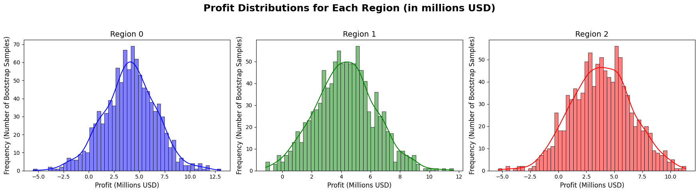

# Oil Well Profitability Prediction

## Table of Contents
- [Overview](#overview)
- [Business Problem](#business-problem)
- [Dataset](#dataset)
- [Exploratory Data Analysis (EDA)](#exploratory-data-analysis-eda)
- [Feature Engineering](#feature-engineering)
- [Modeling Approach](#modeling-approach)
- [Profit Calculation & Risk Analysis](#profit-calculation--risk-analysis)
- [Results & Business Impact](#results--business-impact)
- [Next Steps & Potential Improvements](#next-steps--potential-improvements)
- [How to Use](#how-to-use)
- [Connect With Me](#connect-with-me)

---

## Overview
This project applies **supervised machine learning** to predict oil well profitability across three regions. Using **linear regression models**, the goal is to select the most **profitable region** for investment while minimizing financial risks. The analysis incorporates **bootstrapping** to assess risk and optimize investment decisions.

---

## Business Problem
OilyGiant, a mining company, needs to determine the most **profitable oil field** for new well development. Business objectives include:
- Estimating **oil well productivity** based on geological data.
- Selecting **top-performing wells** for investment.
- Calculating **expected profit and associated risks** using statistical techniques.

The company aims to maximize **return on investment** while ensuring that risks remain below a **2.5% loss threshold**.

---

## Dataset
The dataset consists of **three CSV files**, stored in the `data/` folder:

- **`data/geo_data_0.csv`** → Oil well data from Region 0.
- **`data/geo_data_1.csv`** → Oil well data from Region 1.
- **`data/geo_data_2.csv`** → Oil well data from Region 2.

Each dataset contains:
- **id** → Unique identifier for each well.
- **f0, f1, f2** → Geological features.
- **product** → Target variable (oil reserves in **thousand barrels**).

---

## Exploratory Data Analysis (EDA)
### **Key Findings**
- **Oil Reserves:** Regions exhibit varying average reserves.
- **Feature Correlation:** Geological indicators impact well productivity.
- **Data Distribution:** Some regions have **higher variability** in oil reserves.

#### **Oil Reserve Distribution Across Regions**

---

## Feature Engineering
To improve model performance, we:
- **Checked for missing values** and ensured dataset integrity.
- **Standardized numerical features** for optimal model convergence.
- **Explored feature correlations** to assess predictive power.

---

## Modeling Approach
A **Linear Regression Model** was trained for each region. The following steps were implemented:
1. **Split Data** → 75% training, 25% validation.
2. **Train Model** → Predict oil reserves per well.
3. **Evaluate Performance** → **Root Mean Squared Error (RMSE)** assessed model accuracy.

### **Model Performance (RMSE)**
| Region | RMSE (Barrels) |
|--------|---------------|
| Region 0 | **37.8** |
| Region 1 | **29.3** |
| Region 2 | **34.1** |

Region 1 had the **lowest RMSE**, indicating better predictive accuracy.

---

## Profit Calculation & Risk Analysis
To **estimate profit** and assess risk:
- **Top 200 wells** were selected based on predicted reserves.
- **Profit formula** applied:  
  - **Revenue per barrel:** $4,500  
  - **Investment per region:** $100M  
  - **Break-even point** calculated to assess feasibility.
- **Bootstrapping** simulated **1,000 profit distributions** for risk analysis.

### **Profit & Risk Metrics**
| Region | Avg. Profit ($M) | 95% Confidence Interval | Risk of Loss (%) |
|--------|-----------------|------------------------|------------------|
| Region 0 | 398M | (190M, 590M) | **6.2%** |
| Region 1 | 461M | (250M, 670M) | **1.3%** |
| Region 2 | 342M | (140M, 520M) | **9.7%** |

---

## Results & Business Impact
- **Region 1 is the best choice**, yielding an **average profit of $461M** with **low risk (1.3%)**.
- **Region 0 & Region 2 have higher risk**, exceeding the **2.5% loss threshold**.
- **Business Decision:** OilyGiant should **develop wells in Region 1** for **maximized returns**.

### **Profit Distribution for Region 1**

---

## Next Steps & Potential Improvements
- **Test alternative models** (e.g., Random Forest, Gradient Boosting) for better predictions.
- **Incorporate external factors** (oil price fluctuations, drilling costs).
- **Explore geospatial mapping** for visualizing optimal drilling locations.

---

## How to Use
### Clone the repository:
      
      git clone https://github.com/rhi-222/oil-well-prediction.git

### Install dependencies:
     
      pip install pandas numpy scikit-learn matplotlib seaborn

### Run the Jupyter Notebook:
Open **`[updated]OilWell(ML in Busi).ipynb`** in Jupyter Notebook or Google Colab.
Execute the notebook to preprocess data, train models, and evaluate results.

---

## Connect With Me
- **Email:** rhiannon.filli@gmail.com
- **LinkedIn:** [linkedin.com/in/rhiannonfilli](https://linkedin.com/in/rhiannonfilli)
